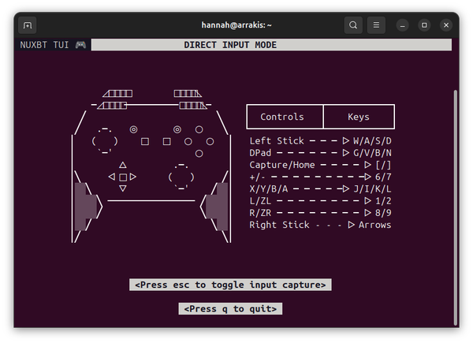

<h1 align="center">
  <br>
  
  <br>
  NUXBT
  <br>
</h1>

<h4 align="center">Fork and update of the original <a href="https://github.com/Brikwerk/nuxbt">NUXBT</a> - maintaining this fork as the original author has not been active for over 2 years.</h4>

<h4 align="center">Control your Nintendo Switch through a website, terminal, or macro.</h4>

<div align="center">

[](/LICENSE)

</div>

## Table of Contents

- [✨ Key Features](#key-features)
- [📦 Installation](#installation)
- [🚀 Getting Started](#getting-started)
- [🌐 Using the Webapp](#using-the-webapp)
- [💻 Using the TUI](#using-the-tui)
- [🤖 Running Macros](#running-macros)
- [🐍 Using the API](#using-the-api)
- [🔧 Troubleshooting](#troubleshooting)
- [🔮 Future Plans](#future-plans)
- [🐛 Issues](#issues)
- [👥 Credits](#credits)
- [📄 License](#license)

## Key Features

- Use your favourite web browser to control a Nintendo Switch with any keyboard or gamepad.
- Use your terminal to control a Nintendo Switch with a keyboard.
- Use a macro from your terminal, browser, or Python script
- Use the NUXBT Python API to write programs to control your Nintendo Switch.
- Robust loop and hold support for macros in the webapp.
- In-depth command line interface.
- Support for emulating multiple controllers at once (requires multiple bluetooth adapters).
- Support for fast connection or reconnection to a Nintendo Switch.
- Emulated controllers support thread-safe access.
- Record and replay macros through the webapp.

## Installation

### Linux (DEB/RPM - Recommended)

## Ubuntu PPA

1. Add the PPA to your system:
```bash
sudo add-apt-repository ppa:hannahbee-0602/nuxbt
sudo apt update
```

2. Install NUXBT:
```bash
sudo apt install nuxbt
```

### GitHub Releases Installation

1. Go to the [Releases page](https://github.com/hannahbee91/nuxbt/releases/latest).
2. Download the appropriate package for your system (`.deb` for Debian/Ubuntu, `.rpm` for Fedora/CentOS/openSUSE).
3. Install the package:

   **Debian/Ubuntu:**
   ```bash
   sudo apt install ./nuxbt_*.deb
   ```

   **Fedora/RedHat:**
   ```bash
   sudo dnf install ./nuxbt-*.rpm
   ```

This will properly install dependencies and available update the `nuxbt` command on your system.

  **Running NUXBT:**
  ```bash
  nuxbt
  ```

### Linux (Manual / Pip)

```bash
pip --user install nuxbt
```

This will install NUXBT into your current Python environment, for your user only.

### Bluetooth Permissions

NUXBT requires the BlueZ Input plugin to be disabled to function correctly as a controller.

To check the status of the plugin:
```bash
nuxbt check
```

To toggle the plugin (enable/disable):
```bash
nuxbt toggle
```
**Note:** Toggling the plugin will request `sudo` permissions to modify system Bluetooth configuration.

### Windows and macOS

See the installation guide [here.](docs/Windows-and-macOS-Installation.md)
 
Additional detailed Korean documents:

- Usage guide: [docs/Usage-Guide-ko.md](docs/Usage-Guide-ko.md)
- Improvement notes: [docs/Improvement-Notes-ko.md](docs/Improvement-Notes-ko.md)

For the VirtualBox + Vagrant workflow, a practical browser entrypoint is:

```bash
http://192.168.56.10:8000
```

If you are debugging USB passthrough from macOS, you can also run the optional host USB bridge:

```bash
python3 scripts/host_usb_bridge.py
```

This exposes the host USB device list on `http://127.0.0.1:8765/api/usb-host` so the web UI can show which USB Bluetooth dongle VirtualBox has captured.

## Development and Contributing

NUXBT uses a Python backend and a React (TypeScript + Vite) frontend.

### Prerequisites
*   Python 3.12 or higher
*   [Poetry](https://python-poetry.org/docs/#installation) for dependency management
*   Node.js 24 and npm (for the frontend)
*   BlueZ development headers (Linux only, see Installation section)

### 1. Setting up the Backend

```bash
# Install dependencies with Poetry
poetry install
```

### 2. Building the Frontend
The frontend code resides in `nuxbt/web/client`. You must build it before running the webapp, as Flask serves the compiled assets.

```bash
cd nuxbt/web/client
npm install
npm run build
```

This will compile the React app and place the assets into `nuxbt/web/static`, where the Python backend expects them.

### 3. Running Locally
Once built, you can run the webapp using Poetry.

```bash
# Run the webapp pointing to the poetry environment
$(poetry which nuxbt) webapp
```

## Getting Started

### Running the demo

The demo is meant to gauge whether or not NUXBT is working. To do so, the demo will create a Pro Controller and run through a small loop of commands.

**NOTE:** If this is your first time connecting to an NUXBT emulated controller on the specific host computer, you **MUST** have the "Change Grip/Order Menu" open on your Nintendo Switch. You can see how to navigate to the "Change Grip/Order Menu" [HERE](docs/img/change-grip-order-menu.png).

To start the demo, run the following command in your terminal:

```bash
nuxbt demo
```

If all is working correctly, the controller should connect, navigate to the settings, test the stick calibration, and navigate back to the "Change Grip/Order Menu".

## Using the Webapp

The NUXBT webapp provides a web interface that allows for quick creation of a Nintendo Switch controller and use of a keyboard or gamepad to control the Nintendo Switch. This lets anyone who can access the website control a Nintendo Switch with their favourite keyboard or gamepad.

The webapp server can be started with the following command:

```bash
nuxbt webapp
```

The above command boots NUXBT and an accompanying web server that allows for controller creation and use over your web browser.

The webapp itself will be locally accessible at `http://127.0.0.1:8000` or, if you're on the same network as the host computer, http://HOST_COMPUTER_IP:8000. It's also possible to expose your NUXBT webapp to the internet, however, you'll need to configure a reverse proxy, which is out of the scope of this readme.

When running inside the provided VirtualBox + Vagrant VM on macOS or Windows, use the host-only adapter address instead:

```bash
http://192.168.56.10:8000
```

You should see a webpage similar to the following image:

| Light Mode | Dark Mode |
| :---: | :---: |
|  |  |

To create and start a Pro Controller, click the "Create Pro Controller" button. If creation/boot is successful, the website will switch to the connected controller screen, with a pill showing the connection status. During this time, you should have the Nintendo Switch you wish to connect to powered on and within range of the host computer.

**NOTE:** If this is your first time connecting to your Nintendo Switch with the specific host computer, make sure you're on the "Change Grip/Order Menu". If you're still unable to connect, try running the demo (in the above section) or refer to the troubleshooting documentation.

Once you've successfully connected to the Nintendo Switch, you should see a webpage similar to below:

| Light Mode | Dark Mode |
| :---: | :---: |
|  |  |

Here, you can shutdown or restart the controller, and use the Macros tab to create, manage, and run macros.

| Light Mode | Dark Mode |
| :---: | :---: |
|  |  |

## Using the TUI

The TUI (Terminal User Interface) allows for local or remote (SSH/Mosh) terminal sessions to control a Nintendo Switch with a keyboard.

The TUI can be started with:

```bash
nuxbt tui
```

**NOTE:** If this is your first time connecting to your Nintendo Switch with the specific host computer, make sure you're on the "Change Grip/Order Menu". If you're still unable to connect, try running the demo (in the above section) or refer to the troubleshooting documentation.

A loading screen should open and, once connected, the main TUI control screen should load. This should look something like below:

<div align="center">
  
</div>

There are two types of NUXBT TUI sessions:
1. **Remote Mode:** When connecting over an SSH (or Mosh) connection, "Remote Mode" is used to compensate for keyup events not being sent over remote terminal sessions. This functionally means that "Remote Mode" is a bit less responsive than "Direct Mode".
2. **Direct Mode (pictured above):** When running the NUXBT TUI directly on the host computer, keyboard key presses are taken directly from any keyboard plugged in.

Once you've successfully connected to a Nintendo Switch over the "Change Grip/Order Menu", you can reconnect quickly to the same Switch with the following command:

```bash
nuxbt tui -r
```

A couple other funcionality notes:
- Press 'q' to exit the TUI.
- In Direct Mode, press Escape to toggle input to the Nintendo Switch.
- NUXBT looks for SSH and Mosh connections before deciding whether or note Remote Mode should be used. If you use another method for creating a remote terminal instance, NUXBT likely won't detect it. Please open an issue if this happens to you!

## Running Macros

NUXBT provides three ways to run macros on your Nintendo Switch:

1. The NUXBT Webapp (easiest)
2. The CLI
3. The Python API

For the first method, refer to the "Using the Webapp" section for more info.

For info on writing macros, check out the documentation [here](docs/Macros.md).

### Running Macros with the Command Line Interface

To run a simple, inline macro, you can use the following command:

```bash
nuxbt macro -c "B 0.1s\n 0.1s"
```

The above command will press the B button for 0.1 seconds and release all buttons for 0.1 seconds. The `-c` flag specifies the commands you would like to run. You'll need to be on the "Change Grip/Order Menu" for the above command to work. If you've already connected to the Switch on the host computer, you can reconnect and run the macro by adding the `-r` or `--reconnect` flag:

```bash
nuxbt macro -c "B 0.1s\n 0.1s" -r
```

Since it can be a little cumbersome typing out a large macro in the terminal, the macro command also supports reading from text files instead!

commands.txt file:
```
B 0.1s
0.1s
```

```bash
nuxbt macro -c "commands.txt" -r
```

If you want more information on NUXBT's CLI arguments:

```bash
nuxbt -h
```

### Running Macros with the Python API

Macros are supported with the `macro` function in the Python API. All macros are expected as strings (multiline strings are accepted).

Minimal working example:

```python
import nuxbt

macro = """
B 0.1s
0.1s
"""

# Start the NUXBT service
nx = nuxbt.Nuxbt()

# Create a Pro Controller and wait for it to connect
controller_index = nx.create_controller(nuxbt.PRO_CONTROLLER)
nx.wait_for_connection(controller_index)

# Run a macro on the Pro Controller
nx.macro(controller_index, macro)
```

The above example uses a blocking macro call, however, multiple macros can be queued (or other actions taken) with the non-blocking syntax. Queued macros are processed in FIFO (First-In-First-Out) order.

```python
# Run a macro on the Pro Controller but don't block.
# In this instance, we record the macro ID so we can keep track of its status later on.
macro_id = nx.macro(controller_index, macro, block=False)

from time import sleep
while macro_id not in nx.state[controller_index]["finished_macros"]:
    print("Macro hasn't finished")
    sleep(1/10)

print("Macro has finished")
```

## Using the API

NUXBT provides a Python API for use in Python applications or code.

If you're someone that learns by example, check out the `demo.py` file located at the root of this project.

For a more in-depth look at all the functionality provided by the API, checkout the `nuxbt/nuxbt.py` file.

For those looking to get started with a few simple examples: Read on!

**Creating a Controller and Waiting for it to Connect**
```python
import nuxbt

# Start the NUXBT service
nx = nuxbt.Nuxbt()

# Create a Pro Controller and wait for it to connect
controller_index = nx.create_controller(nuxbt.PRO_CONTROLLER)
nx.wait_for_connection(controller_index)

print("Connected")
```

**Pressing a Button**
```python
# Press the B button
# press_buttons defaults to pressing a button for 0.1s and releasing for 0.1s
nx.press_buttons(controller_idx, [nuxbt.Buttons.B])

# Pressing the B button for 1.0s instead of 0.1s
nx.press_buttons(controller_idx, [nuxbt.Buttons.B], down=1.0)
```

**Tilting a Analog Stick**
```python
# Tilt the right stick fully to the left.
# tilt_stick defaults to tilting the stick for 0.1s and releasing for 0.1s
nx.tilt_stick(controller_idx, Sticks.RIGHT_STICK, -100, 0)

# Tilting the stick for 1.0s instead of 0.1s
nx.tilt_stick(controller_idx, Sticks.RIGHT_STICK, -100, 0, tilted=1.0)
```

**Getting the available Bluetooth adapters**
```python
# This prints the device paths for each available adapter.
# If a controller is in use, an adapter will be removed from this list.
print(nx.get_available_adapters)
```

**Shutting Down a running Controller**
```python
# This frees up the adapter that was in use by this controller
nx.remove_controller(controller_index)
```

**Reconnecting to a Switch**
```python
# Get a list of all previously connected Switches and pass it as a reconnect_address argument
controller_index = nx.create_controller(
    nuxbt.PRO_CONTROLLER,
    reconnect_address=nx.get_switch_addresses())
```

**Stopping or Clearing Macros**
```python
# Stops/deletes a single macro from a specified controller
nx.stop_macro(controller_index, macro_id)

# Clears all macros from a given controller
nx.clear_macros(controller_index)

# Clears all macros from every created controller
nx.clear_all_macros()
```

## Troubleshooting

### I get an error when installing the `dbus-python` or `PyGObject` package

This error can occur due to missing dbus-related libraries or GObject introspection headers on some Linux distributions (especially Ubuntu 24.04+). To fix this, `libdbus-glib-1-dev`, `libdbus-1-dev`, `libcairo2-dev`, and `libgirepository-2.0-dev` (or `libgirepository1.0-dev` on older systems) need to be installed with your system's package manager. For systems using aptitude for package management (Ubuntu, Debian, etc), installation instructions follow:

```bash
sudo apt-get install libdbus-glib-1-dev libdbus-1-dev libcairo2-dev libgirepository-2.0-dev pkg-config
```

### My controller disconnects after exiting the "Change Grip/Order" Menu

This can occasionally occur due to timing sensitivities when transitioning off of the "Change Grip/Order" menu. To avoid disconnections when exiting this menu, please only press A (or B) a single time and wait until the menu has fully exited. If a disconnect still occurs, you should be able to reconnect your controller and use NUXBT as normal.

### "No Available Adapters"

This means that NUXBT wasn't able to find a suitable Bluetooth adapter to use for Nintendo Switch controller emulation. Only one controller can be emulated per adapter on the system, so if you've got one Bluetooth adapter available, you'll only be able to emulate one Nintendo Switch controller. The general causes (and solutions) to the above error follows:

1. **Cause:** All available adapters are currently emulating a controller.
  - **Solution:** End one of the other controller sessions (either through the webapp or command line) or plug in another Bluetooth adapter.
2. **Cause:** No Bluetooth adapters are available to NUXBT.
  - **Solution:** Ensure that you've installed the relevant Bluetooth stack for your operating system (BlueZ on Linux) and check that your Bluetooth adapter is visible within to your OS.

### "Address already in use"

This means that another service has already bound itself to the Control and Interrupt ports on the specified Bluetooth adapter. Causes/solutions follow:

1. **Cause:** (Linux specific solution) This is typically the BlueZ input plugin binding itself to the Control/Interrupt ports for your adapter.
  - **Solution:** Either disable the input plugin (you will lose access to Bluetooth keyboards/mice while it is disabled) or install NUXBT as root to allow for temporary toggling of the Input plugin.

## Future Plans

1. Allows for rebinding keys within the TUI and webapp
2. Add a touchscreen input option for the webapp to enable input on smartphones
3. Transition the webapp to a more maintainable React build
4. Allow for recording macros from direct input over the TUI
5. Locally store created macros, allowing for naming and reusing across sessions
6. ~~Create Flatpak~~ - Not possible due to needing root access to bluetooth modules
7. Add support for Switch 2 controller emulation

### Plans that Need More Testing

- Use mouse movement as right stick input

## Issues

- Switching from the slow frequency mode on the "Change Grip/Order" menu to the full input report frequency is still a bit of a frail process. Some game start menus have a frequency of 15Hz but specifically only allow exiting by pressing the A button. The "Change Grip/Order" menu allows for exiting with A, B, or the Home button, however.
- The webapp can sometimes have small amounts of input lag (<8ms).

## Credits

A big thank you goes out to all the contributors at the [dekuNukem/Nintendo_Switch_Reverse_Engineering](https://github.com/dekuNukem/Nintendo_Switch_Reverse_Engineering) repository! Almost all information pertaining to the innerworkings of the Nintendo Switch Controllers comes from the documentation in that repo. Without it, NUXBT wouldn't have been possible.

## License

MIT
